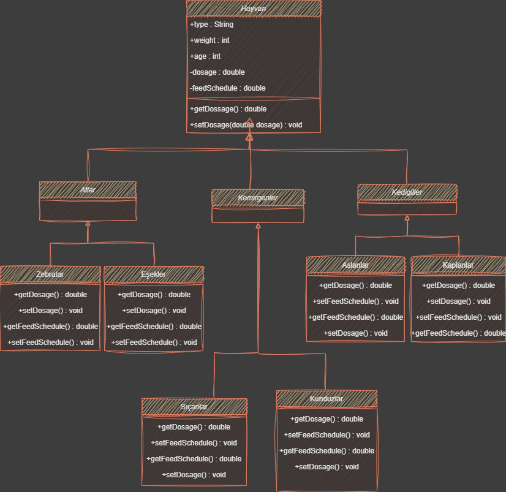

# Zoo-Class-Diagram

---

## Turkish

Bir hayvanat bahçesindeki hayvanlar hakkındaki bilgileri takip etmek için bir sistem tasarlıyorsunuz.

1. Hayvanlar:
   1. Atlar (atlar, zebralar, eşekler vb.),
   1. Kedigiller (kaplanlar, aslanlar vb.),
   1. Kemirgenler (sıçanlar, kunduzlar vb.) gibi gruplardaki türlerle karakterize edilir.
1. Hayvanlar hakkında depolanan bilgilerin çoğu tüm gruplamalar için aynıdır. (tür adı, ağırlığı, yaşı vb.)
1. Sistem ayrıca her hayvan için belirli ilaçların dozajını alabilmeli => getDosage ()
1. Sistem Yem verme zamanlarını hesaplayabilmelidir => getFeedSchedule ()
1. Sistemin bu işlevleri yerine getirme mantığı, her gruplama için farklı olacaktır. Örneğin, atlar için yem verme algoritması farklı olup, kaplanlar için farklı olacaktır.

Polimorfizm modelini kullanarak, yukarıda açıklanan durumu ele almak için bir sınıf diyagramı tasarlayın.
---
## English

You are designing a system to track information about animals in a zoo.

1. Animals:
   1. Equines (horses, zebras, donkeys, etc.),
   1. Felines (tigers, lions, etc.),
   1. Rodents (rats, beavers, etc.).
1. Most of the information stored about animals is the same for all groupings.(species name, weight, age, etc.)
1. The system should also be able to get the dosage of specific drugs for each animal => getDosage ()
1. The system should be able to calculate feeding times => getFeedSchedule ()
1. The logic by which the system performs these functions will be different for each grouping. For example, the algorithm for feeding horses will be different for horses and different for tigers.

Using the polymorphism model, design a class diagram to handle the situation described above.

